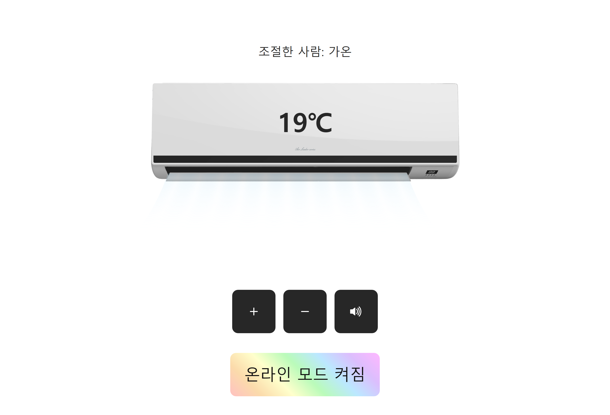
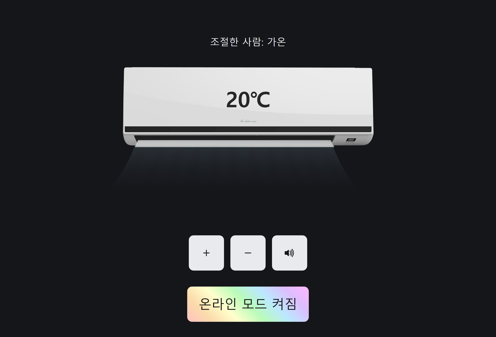

# myaircon

모두가 함께 쓰는 **온라인 에어컨**. 접속한 사람 전원이 온도계 하나를 공유하고,
Web Audio API로 만든 브라운 노이즈가 온도에 따라 음량을 바꾼다.
겨울에는 에어컨 대신 **온풍기**가 뜬다.

한국어 · English · 日本語 · 简体中文 · 繁體中文 · 라이트/다크 · 반응형 · 실시간 통계

[](https://github.com/gaon12/myaircon/actions/workflows/ci.yml)

[codingapple1/myaircon.online](https://github.com/codingapple1/myaircon.online)의 fork다.
원본은 서비스가 종료됐고, 이 저장소는 재오픈을 위해 런타임과 의존성을 최신으로
올리고 알려진 버그를 정리한 버전이다.

<p>
  
  
</p>

## 요구 사항

- 서버: Node.js **24 이상**
- 브라우저: Chrome 93+ · Edge 93+ · Firefox 98+ · Safari 15.4+

  더 오래된 브라우저(IE 포함)에는 앱 대신 안내만 보여준다. 반쯤 동작하는
  화면을 내놓으면 사용자가 무엇이 문제인지 알 수 없기 때문이다.
  IE처럼 ES 모듈을 모르는 브라우저는 `<script nomodule>`이,
  모듈은 되지만 API가 없는 중간 세대는 `src/client/compat.ts`가 잡는다.
  하한을 정하는 것은 사실상 `<dialog>.showModal`이다.

## 실행

```bash
npm install         # prepare 훅이 TypeScript를 빌드한다
npm start           # http://localhost:8080
```

개발 중에는 클라이언트 초기 빌드 후 클라이언트 컴파일과 서버 재시작을 함께 감시한다:

```bash
npm run dev
```

클라이언트 또는 공유 TypeScript를 수정하면 `public/js/`를 다시 컴파일한다.
브라우저를 새로고침하면 변경이 보인다. 서버는 TypeScript 소스를 직접 실행하며
의존 파일 변경 시 재시작한다. 초기 클라이언트 타입 오류가 있으면 서버를 열지 않고
실패한다. 감시 중 타입 오류가 있으면 마지막 성공 산출물을 유지한다.
개발 서버는 기본적으로 `127.0.0.1`에 바인딩하며, 필요한 경우에만 `HOST`를 지정한다.
Ctrl+C로 두 감시자와 하위 프로세스를 함께 종료한다.

> **오디오는 secure context에서만 동작한다.**
> `AudioWorklet.addModule()`은 `localhost` 또는 `https`에서만 성공한다.
> 그 외 환경에서는 소리가 나지 않고 화면에 안내가 뜬다(앱은 정상 동작).

## 스크립트

| 명령 | 설명 |
| --- | --- |
| `npm run build` | TypeScript 컴파일 (`dist/`, `public/js/`) |
| `npm start` | 서버 실행 (`prestart`가 먼저 빌드한다) |
| `npm run dev` | 클라이언트 초기 빌드·컴파일 감시 + 서버 소스 재시작 |
| `npm run typecheck` | 서버/클라이언트/테스트 타입 검사 |
| `npm test` | 테스트 (Node 내장 러너, 빌드 불필요) |
| `npm run test:watch` | 테스트 watch 모드 |
| `npm run lint` | Biome 린트 |
| `npm run format` | Biome 포맷 적용 |
| `npm run check` | 린트 + 포맷 자동 수정 |
| `npm run ci` | `biome ci` + 타입 검사 + 테스트 (CI용, 파일을 고치지 않음) |

## 설정

모든 설정은 환경변수로 하며 전부 선택 사항이다. 전체 목록과 기본값은
[`.env.example`](.env.example)에 있고, 검증 로직은
[`src/server/config.ts`](src/server/config.ts)에 있다.
잘못된 값은 부팅 시점에 바로 에러가 난다.

자주 쓰는 것만:

| 변수 | 기본값 | 설명 |
| --- | --- | --- |
| `HOST` / `PORT` | `0.0.0.0` / `8080` | 바인딩 주소 |
| `TRUST_PROXY_HOPS` | `0` | 신뢰하는 리버스 프록시 홉 수 (아래 참고) |
| `DEVICE_MODE` | `auto` | `auto` / `aircon` / `heater` (아래 참고) |
| `WINTER_MONTHS` | `11,12,1,2,3` | 온풍기로 취급할 월 |
| `SERVICE_TIMEZONE` | (서버 로컬) | 계절 판정과 통계 "오늘"의 IANA 시간대 |
| `STATS_ENABLED` | `true` | 순위·기록·활동 그래프 수집 |
| `ADMIN_TOKEN` | (없음) | 설정해야 관리 API와 `/admin.html`이 열린다 |
| `GUARD_ENABLED` | `true` | 요청·연결 제한과 행동 점수 |
| `GUARD_MAX_SOCKETS_PER_IP` | `8` | IP당 동시 소켓 수 상한 |
| `TEMP_MIN` / `TEMP_MAX` | `18` / `30` | 온도 범위 |
| `PERSIST_STATE` | `true` | 공유 온도를 디스크에 저장할지 |
| `RATE_LIMIT_POINTS` | `10` | `RATE_LIMIT_DURATION_SECONDS`(기본 2초)당 허용 횟수 |
| `HSTS_MAX_AGE` | `0` (끔) | https 뒤에 배포할 때만 켤 것 |

## 에어컨 / 온풍기

계절에 따라 기기가 바뀐다. 공유 기기이므로 **서버가 정해서 접속자 전원에게 같은
값을 내려준다** — 사용자마다 다른 기기를 보면 "다 같이 쓰는 온도계"가 성립하지 않는다.

| `DEVICE_MODE` | 동작 |
| --- | --- |
| `auto` (기본) | 현재 월이 `WINTER_MONTHS`에 있으면 온풍기, 아니면 에어컨 |
| `aircon` | 계절과 무관하게 에어컨 고정 |
| `heater` | 계절과 무관하게 온풍기 고정 |

판단 기준은 **서버 시간**이다. 접속자의 시간대가 아니다 — 보는 사람마다 계절이
달라지면 안 되기 때문이다.

기본값은 서버 프로세스의 로컬 시간대인데, 대부분의 컨테이너는 UTC라 배포
환경에 따라 결과가 달라진다. `SERVICE_TIMEZONE=Asia/Seoul` 처럼 명시하면
어디에 배포하든 같은 기준으로 판정한다 (잘못된 이름은 부팅 시점에 거부된다).
예를 들어 `2026-10-31 15:30 UTC`는 UTC로 보면 10월(에어컨), `Asia/Seoul`로
보면 11월(온풍기)이다. 같은 설정이 통계의 "오늘" 경계도 정한다.
(예전 이름 `SEASON_TIMEZONE`도 계속 받는다.)
서버가 몇 달씩 떠 있을 수 있으므로 부팅 때 한 번 정하고 끝내지 않고, 1시간마다
(`DEVICE_RECHECK_INTERVAL_MS`) 다시 확인해 바뀌면 접속 중인 클라이언트에
`deviceChange`를 보낸다.

온풍기는 높게 맞출수록, 에어컨은 낮게 맞출수록 세게 돌아간다. 브라운 노이즈의
음량 방향도 기기에 따라 뒤집힌다.

### 온풍기 이미지

`public/heater0.png`에 투명 배경의 전용 온풍기 본체가 포함되어 있다.
본체에는 고정 루버가 그려져 있어 에어컨용 보조 팬은 숨기고, 공통 바람 그래픽은
따뜻한 색으로 표시한다. 에어컨으로 전환하거나 본체가 누락되면 원래 표시로 돌아간다.
생성 도구와 프롬프트는 [이미지 기록](docs/heater-asset.md)에 있다.

다음 이름의 파일이 있으면 서버가 해당 경로를 선택한다.

```
public/heater0.png      본체 (포함)
public/heater-fan.png   별도 움직이는 팬 (선택)
public/heater-air.png   전용 바람 (선택)
```

폴백은 **파일 단위**다. 현재 보조 에셋은 공통 파일을 사용하므로
`usingFallback`은 `true`다. 별도 팬을 추가하면 숨기지 않고 표시하며,
기존 이미지의 크기·여백과 팬 위치(`--fan-offset`)를 맞춰야 한다.

## 배포

### 리버스 프록시 뒤에 둘 때는 `TRUST_PROXY_HOPS`를 반드시 설정할 것

rate limit은 클라이언트 주소를 키로 쓴다. 기본값 `0`에서는 `X-Forwarded-For`를
**무시하고** TCP 소켓의 원격 주소만 본다. 프록시 뒤에서 이 값을 그대로 두면
모든 사용자가 프록시의 주소 하나를 공유하게 되어 전체가 한 버킷에 갇힌다.

반대로 프록시가 없는데 `1` 이상으로 두면, 클라이언트가 헤더를 위조해 rate limit을
통째로 무력화할 수 있다. **실제 구성과 정확히 일치시킬 것.**

```
nginx 한 대 뒤        TRUST_PROXY_HOPS=1
CDN + nginx 두 단 뒤   TRUST_PROXY_HOPS=2
```

### 리버스 프록시 설정 예시

바로 쓸 수 있는 예시를 넣어 두었다. 틀리기 쉬운 것들(WebSocket 업그레이드,
타임아웃, `X-Forwarded-For`)을 주석으로 짚었다.

- [`deploy/nginx.conf.example`](deploy/nginx.conf.example)
- [`deploy/apache.conf.example`](deploy/apache.conf.example)

특히 두 가지를 놓치기 쉽다.

1. **WebSocket 업그레이드를 넘기지 않으면** socket.io가 polling으로만 붙거나
   아예 실패한다. 그리고 `proxy_read_timeout` 기본값(60초)을 그대로 두면
   연결이 조용히 끊긴다.
2. **HSTS를 프록시와 앱 양쪽에서 켜지 말 것.** 프록시에서 켰다면 앱은
   `HSTS_MAX_AGE=0`(기본값)으로 둔다.

### 프로세스 관리

pm2 등으로 띄우고 싶다면 전역에 설치해서 쓴다. 프로세스 매니저는 배포 환경의
책임이지 애플리케이션의 런타임 의존성이 아니므로 `dependencies`에 넣지 않았다.

```bash
npm i -g pm2
npm ci && npm run build
pm2 start dist/server/server.js --name myaircon
pm2 save
```

> `pm2 start npm -- start` 로 띄우지 말 것. `start`에는 `prestart` 훅이
> 걸려 있어서 pm2가 재시작할 때마다 `tsc`가 다시 돈다. 빌드는 배포할 때
> 한 번만 하면 된다.

`SIGTERM`/`SIGINT`를 받으면 열린 소켓을 정리하고 마지막 온도를 저장한 뒤 종료한다.

### GitHub Actions (CI / CD)

- [`.github/workflows/ci.yml`](.github/workflows/ci.yml) — push와 PR마다
  `npm run ci`(Biome + 타입 검사 + 테스트)를 돌리고 빌드 산출물이 실제로
  나왔는지 확인한다. 로컬과 같은 스크립트를 부르므로 "로컬에서는 되는데
  CI에서 깨진다"가 생기지 않는다.
- [`.github/workflows/deploy.yml`](.github/workflows/deploy.yml) — `main`에
  올라가면 CI를 다시 통과시킨 뒤 SSH로 서버에 들어가 배포한다.
  실제 절차는 [`deploy/remote-deploy.sh`](deploy/remote-deploy.sh)에 있다.

배포는 이 순서다.

```
git fetch && git reset --hard <sha>   # pull이 아니다 (아래 참고)
npm ci --ignore-scripts
npm run build
pm2 reload <name>   (없으면 start)
curl /healthz       실패하면 이전 커밋으로 되돌린다
```

**`git pull`이 아니라 `reset --hard`인 이유.** pull은 서버에 손댄 파일이
남아 있으면 멈추고, 최악의 경우 머지 커밋을 만든다. 배포된 서버의 작업
트리는 커밋 하나를 그대로 비추기만 하면 된다. `git clean`도 함께 돌리되
`data/`(공유 온도·통계·차단 목록)와 `node_modules/`는 남긴다.

**health check가 통과해야 성공이다.** pm2가 "떴다"고 말하는 것과 서버가
실제로 응답하는 것은 다르다. `/healthz`가 40초 안에 답하지 않으면 이전
커밋으로 되돌리고 pm2 로그 50줄을 남긴 뒤 실패로 끝낸다.

#### 준비 (한 번만)

서버에서:

```bash
sudo mkdir -p /srv/myaircon && sudo chown "$USER" /srv/myaircon
git clone https://github.com/gaon12/myaircon /srv/myaircon
cd /srv/myaircon && npm ci && npm run build
pm2 start dist/server/server.js --name myaircon && pm2 save && pm2 startup
```

배포 전용 SSH 키를 만들고 공개키를 서버의 `~/.ssh/authorized_keys`에 넣는다.

```bash
ssh-keygen -t ed25519 -C myaircon-deploy -f ~/.ssh/myaircon-deploy -N ""
ssh-keyscan -p 22 <서버주소>          # 아래 SSH_KNOWN_HOSTS에 넣을 값
```

리포지토리 **Secrets**:

| 이름 | 값 |
| --- | --- |
| `SSH_HOST` | 서버 주소 |
| `SSH_USER` | 접속 계정 |
| `SSH_KEY` | 위에서 만든 **개인키** 전문 |
| `SSH_KNOWN_HOSTS` | `ssh-keyscan` 출력 |

리포지토리 **Variables** (전부 선택, 괄호 안이 기본값):

| 이름 | 기본값 |
| --- | --- |
| `SSH_PORT` | `22` |
| `DEPLOY_PATH` | `/srv/myaircon` |
| `PM2_NAME` | `myaircon` |
| `HEALTH_URL` | `http://127.0.0.1:8080/healthz` |

> **`SSH_KNOWN_HOSTS`를 비워 두지 말 것.** 흔히 쓰는 방법이 러너에서
> `ssh-keyscan`을 즉석에서 돌리는 것인데, 그건 처음 만난 키를 무조건 믿는
> 것이라 중간자에게 그대로 배포해 버릴 수 있다. 그래서 이 워크플로는
> 값이 없으면 아예 시작하지 않는다.

배포 절차 자체가 리포지토리 안에 있으므로, 롤백하면 배포 방식도 함께
돌아간다. 서버에 스크립트를 따로 깔아 둘 필요도 없다 -- ssh의 stdin으로
흘려보낸다.

### HTTP 엔드포인트

```
GET /healthz    ->  {"status":"ok","temp":18,"min":18,"max":30,"device":"aircon","uptimeSeconds":42}
GET /api/stats  ->  {"online":3,"today":[...],"allTime":[...],"recent":[...],"hourly":[...],"at":...}
GET /api/challenge -> 확인용 작업증명 문제 (점수가 애매할 때 클라이언트가 요청)
POST /api/verify   -> 답 제출, 소켓 핸드셰이크에 낼 토큰을 받는다
GET /api/admin/*   -> 관리 API (ADMIN_TOKEN 필요, 아래 참고)
```

### 상태 파일

공유 온도는 `data/state.json`(`STATE_FILE`), 통계는 `data/stats.db`(`STATS_FILE`)에
저장되고, 차단 목록은 `data/bans.db`(`BAN_FILE`)에 저장되어 재시작 후에도 이어진다.
컨테이너로 배포한다면 `data/`를 볼륨으로 잡거나 `PERSIST_STATE=false` /
`STATS_ENABLED=false`로 끈다.

## 오류 화면

404나 500이 나면 Fastify 기본값인 JSON이 나왔다. 주소를 잘못 친 사람에게
`{"message":"Route GET:/nope not found",...}`를 보여주는 것은 아무 도움이
안 된다. 이제 브라우저에는 앱과 같은 모양의 화면 한 장을 준다.

**전부 HTML로 바꾸지는 않았다.** `/api/*`는 앱 자신이 `fetch`로 부르고,
가동 감시나 `curl`도 JSON을 기대한다. 그래서 요청이 무엇을 원하는지 보고
고른다.

| 요청 | 응답 |
| --- | --- |
| `Accept`에 `text/html`이 있고 `/api/*`가 아님 | HTML 화면 |
| 그 외 (`*/*`, `application/json`, 헤더 없음) | `{"error":"not_found","statusCode":404}` |
| `/api/*` | 브라우저가 물어도 항상 JSON |

`curl`의 기본값이 `*/*`라는 점이 중요하다. 와일드카드를 HTML로 치면 스크립트와
감시 도구가 전부 HTML을 받게 된다. 브라우저는 실제로 `text/html`을 앞에 적어
보내므로 이 구분으로 충분하다.

화면은 `Accept-Language`로 언어를 고른다. q값까지 본다 —
`ko;q=0.1,en;q=0.9`면 영어다. **협상 규칙은 앱과 같은 함수**
(`src/shared/negotiate.ts`)를 쓴다. 같은 방문자가 앱에서는 한국어를, 오류
화면에서는 영어를 보게 되면 그게 더 이상하다. 문구만 서버에 따로 적어 두었다
— 클라이언트 로케일은 100개가 넘는 키에 함수까지 든 브라우저용 모듈이라,
서버가 그걸 import 하면 빌드가 뒤엉킨다.

캐릭터도 나온다. `catch` 포즈를 매번 무작위로 고른다.

세 가지를 지킨다.

1. **내부 사정을 밝히지 않는다.** 화면에도 JSON에도 상태 코드뿐이다. 어떤
   라우트가 왜 터졌는지는 로그에만 남는다. 5xx는 `error`로, 4xx는 `info`로
   찍는다 — 잘못 만든 요청까지 error로 남기면 진짜 고장이 파묻힌다.
2. **요청 경로를 되비추지 않는다.** Fastify 기본 404 메시지는 경로를 그대로
   담는다. 그걸 HTML에 넣으면 그 자체로 XSS다. 지금은 아예 넣지 않고,
   그래도 이스케이프 함수를 두고 테스트로 묶어 뒀다.
3. **스크립트가 없다.** CSP가 `script-src 'self'`라 인라인은 실행되지 않고,
   이 화면에 동작이 필요하지도 않다. 스타일은 앱과 같은 `/styles.css`를 쓰므로
   대개 캐시에서 나오고 다크 모드가 저절로 따라온다.

rate limit(429)도 같은 경로를 탄다. 브라우저로 들어온 사람은 화면을,
스크립트는 `Retry-After`가 붙은 JSON을 받는다.

## 다국어

현재 한국어 / English / 日本語 / 简体中文 / 繁體中文.
브라우저의 `navigator.languages`로 협상하고, 푸터의 선택 상자로 직접 바꿀 수 있다
(선택은 저장되며 브라우저 선호 언어보다 우선한다).

중국어는 지역 코드만으로는 자형을 알 수 없어 별도로 매핑한다.
`zh-CN`/`zh-SG` → 간체, `zh-TW`/`zh-HK`/`zh-MO` → 번체, 맨 `zh` → 간체.

### 언어 추가하기

1. `src/client/i18n/locales/<code>.ts`를 만든다. 기존 파일 하나를 복사해서
   값만 바꾸는 것이 가장 빠르다.
2. `src/client/i18n/index.ts`의 `locales`에 한 줄 추가한다. 여기 나열한 순서가
   곧 선택 목록의 순서다.

> 고칠 곳은 `src/`다. `public/js/`는 `tsc`가 뱉는 산출물이라 gitignore 되어
> 있고 다음 빌드에 통째로 덮인다.

각 로케일 파일은 `satisfies Locale`로 계약을 검사받는다. 키를 빠뜨리면 화면에
`undefined`가 뜨는 대신 **컴파일이 실패**한다. `npm test`도 같은 것을 확인한다
(빌드를 건너뛰고 Node로 바로 실행하는 경로가 있기 때문).

## 테마

시스템 / 밝게 / 어둡게 세 가지. 기본은 시스템 설정(`prefers-color-scheme`)을
따르고, 푸터에서 고정할 수 있다. 선택은 저장된다.

색은 전부 CSS 커스텀 프로퍼티다. 다크 값은
`@media (prefers-color-scheme: dark)` 안의 `:root:not([data-theme="light"])`와
`:root[data-theme="dark"]` 두 곳에서 덮어쓴다 — 이 구조라야 "OS 자동"과
"사용자 고정"이 양방향으로 올바르게 동작한다.

> 에어컨 본체 그림은 테마와 무관하게 항상 흰색이다. 그 위에 얹히는 온도
> 텍스트만 `--on-device-ink`로 분리해 어둡게 고정했다. 어두운 색 기기 에셋을
> 넣는다면 이 값도 함께 조정해야 한다.

## 반응형

`--aircon-width: clamp(180px, min(88vw, 58vh), 350px)` 하나로 전체가 스케일한다.
팬과 텍스트 위치는 모두 이 값에 대한 비율이라 크기가 달라져도 정렬이 유지된다.
화면 폭뿐 아니라 높이도 제한하므로 가로 모드에서도 잘리지 않는다.

## 구조

TypeScript로 작성하고 `tsc`가 두 갈래로 컴파일한다.

```
src/
  shared/         서버와 클라이언트가 함께 쓰는 것
    validate.ts   런타임 검증 유틸 (의존성 0)
    protocol.ts   와이어 메시지 스키마 + 타입
    stats.ts      통계 응답 스키마 + 타입
    admin.ts      관리 API 스키마 + 타입
    challenge.ts  확인 절차 스키마 + 타입
    automation.ts 자동화 흔적 이름 + User-Agent 규칙
    characters.ts 캐릭터 수와 무작위 선택
    negotiate.ts  BCP-47 언어 협상 (순수 함수)
  server/
    config.ts       환경변수 기반 설정 (부팅 시점 검증)
    device.ts       계절에 따른 기기 종류 판정과 이미지 경로 해석
    stats-store.ts  통계 집계(메모리) + SQLite 백업
    identity.ts     접속 주소에서 유도한 표시 태그
    ban-store.ts    차단 목록 (메모리 판정 + SQLite 영속)
    admin.ts        관리 API (토큰 인증)
    guard.ts        IP별 카운터와 행동 점수
    challenge.ts    작업증명 발급/검증
    thermostat.ts   공유 온도값. I/O 없는 순수 로직
    nickname.ts     신뢰할 수 없는 닉네임 입력 정규화
    client-ip.ts    rate limit 키가 될 클라이언트 주소 해석
    error-page.ts   404/5xx 등을 사람이 읽는 화면으로
    state-store.ts  온도값 영속화 (디바운스 + 원자적 쓰기)
    realtime.ts     socket.io 이벤트 핸들러
    app.ts          Fastify + socket.io 조립 (listen 안 함)
    server.ts       부트스트랩 / 시그널 처리
  client/
    app.ts        진입점. 브라우저 확인만 하고 통과하면 main.ts를 부른다
    dom.ts        필수 요소 조회 (없으면 시작 시점에 던진다)
    socket.ts     서버 연결 생명주기 + 수신 메시지 검증
    connection-options.ts 같은 출처 WebSocket/polling 연결 옵션
    nickname-dialog.ts 닉네임 입력·복원·변경
    verify-dialog.ts 확인 화면과 작업증명 진행
    stats-dialog.ts 통계 요청 취소·기간 선택·다이얼로그
    audio.ts      브라운 노이즈 재생, 게인 스테이징
    worklet.ts    AudioWorkletProcessor + 순수 DSP
    storage.ts    localStorage 래퍼
    theme.ts      라이트/다크 테마
    stats.ts      통계 화면(순위·최근 기록·활동 그래프)
    admin.ts      관리 화면
    challenge.ts  작업증명 풀이
    automation.ts 자동화 흔적 탐지 (순수 함수)
    compat.ts     브라우저 기능 확인
    main.ts       기기·온도·오디오 상태와 화면 모듈 연결
    i18n/         로케일 등록, Locale 계약
public/
  index.html      마크업 (인라인 script/style 없음)
  admin.html      관리 화면
  robots.txt
  img/            확인 화면·오류 화면 캐릭터 (png-8)
assets/img-src/   캐릭터 원본 PNG (gitignore, 서빙 안 함)
deploy/           리버스 프록시 설정 예시
  styles.css
test/             Node 내장 러너 기반 테스트 (*.test.ts)
```

| 소스 | 산출물 | 쓰임 |
| --- | --- | --- |
| `src/server` + `src/shared` | `dist/` | `npm start`가 실행 |
| `src/client` + `src/shared` | `public/js/` | 정적 서빙 |

산출물은 둘 다 `.gitignore` 대상이고 `npm install`의 `prepare` 훅이 만들어 준다.

`buildApp()`은 조립만 하고 `listen()`은 `server.ts`가 한다. 덕분에 테스트에서
포트 0으로 임의 포트에 띄울 수 있다.

### 빌드 없이 실행되는 이유

소스에서는 `./foo.ts`로 import 하고, `rewriteRelativeImportExtensions`가 컴파일
시 `./foo.js`로 바꿔 내보낸다. 덕분에 **Node 24가 소스를 그대로 실행**할 수 있어
(타입 스트리핑) 테스트는 빌드가 필요 없다. `npm run dev`는 서버 소스를 직접
실행하고 브라우저용 클라이언트를 컴파일한다. 배포는 컴파일된
`dist/`를 쓴다.

`erasableSyntaxOnly`가 `enum`/`namespace`처럼 "지울 수 없는 문법"을 금지해서
이 성질이 실수로 깨지지 않도록 강제한다.

## 런타임 검증

TypeScript의 타입은 컴파일 시점에 전부 지워진다. 바깥에서 들어오는 값은
타입을 적어둬도 런타임에는 아무것도 확인되지 않으므로, 경계마다 실제로 검사한다.

`src/shared/validate.ts`는 의존성 없는 작은 검증기다. 스키마 하나에서
런타임 검사와 컴파일 타임 타입을 함께 얻는다.

```ts
const initMessageSchema = object({
  temp: integer(), min: integer(), max: integer(), device: deviceInfoSchema,
});
type InitMessage = Infer<typeof initMessageSchema>;
```

검사하는 지점:

| 경계 | 하는 일 |
| --- | --- |
| 클라이언트가 받는 서버 메시지 | 형태가 다르면 화면을 건드리지 않고 콘솔에만 남긴다 |
| 서버가 읽는 `state.json` | 손상·손편집·구버전 형식을 걸러내고 초기값으로 시작 |
| 환경변수 | 범위·열거형·시간대까지 부팅 시점에 검사하고 던진다 |
| 클라이언트가 보내는 닉네임 | `unknown`으로 받아 어떤 입력이든 안전한 문자열로 정규화 |
| DOM 조회 | 없는 요소를 시작 시점에 이름과 함께 던진다 |

`object`는 모르는 키를 조용히 버린다. 서버가 필드를 추가해도 예전 클라이언트가
깨지지 않는다.

zod 대신 직접 만든 이유는 클라이언트에 번들러가 없기 때문이다. 브라우저 코드는
`tsc`가 뱉은 ESM을 그대로 서빙하므로, 의존성을 하나 추가하면 그 패키지의 브라우저
빌드까지 따로 서빙해야 한다.

## 통계

Stats 다이얼로그에서 볼 수 있다.

- **현재 접속자 수** — 온라인 모드일 때 푸터에도 표시
- **많이 바꾼 사람** — 오늘 / 역대 상위 10명
- **최근 24시간 활동** — 시간당 조절 횟수 막대 그래프
- **최근 기록** — 마지막 50건
- **내 기록** — 이 브라우저에서 누른 횟수(localStorage)

### 부하를 어떻게 피했나

이 앱의 원래 최대 비용은 이미 브로드캐스트다. 버튼 한 번에 접속자 전원에게
`tempChange`를 보내므로 접속자 1,000명 × 누르는 사람 10명이면 초당 10,000
메시지다. 통계를 여기에 얹으면 안 된다.

| 데이터 | 저장 위치 | 조회 |
| --- | --- | --- |
| 이름별 횟수 (오늘/역대) | 메모리 + SQLite 주기 백업 | pull |
| 시간대별 롤업 | 메모리 + SQLite (하루 24행) | pull |
| 최근 기록 | 메모리 링버퍼 500건 (40KB) | pull |
| 접속자 수 | socket.io 내장 카운터 | push (5초 주기, 변할 때만) |

- **집계는 전부 메모리에서** 한다. 조회가 와도 SQL을 돌지 않는다.
  SQLite(`node:sqlite`, 의존성 0)는 재시작 대비 백업일 뿐이고 5초마다
  배치 커밋한다.
- **통계는 밀지 않고 가져간다.** 다이얼로그를 여는 순간 `GET /api/stats`
  한 번. 버튼마다 `O(접속자 수)`이던 것이 `O(1)`이 된다.
- **모든 이벤트를 영구 저장하지 않는다.** rate limit 상한 기준 활성 IP
  100개면 하루 3.2GB다. 누계와 롤업으로 같은 화면을 만든다.

### 표시용 태그

이름 옆에 `가온#7c2` 처럼 짧은 태그가 붙는다. 같은 이름을 쓰는 사람을 구분하기
위한 것이다.

태그는 `HMAC(비밀키, 접속 주소)`의 앞 3자리다. 그래서

- 클라이언트가 위조할 수 없다 (비밀키를 모른다)
- 새로고침해도 같은 태그가 나온다
- 쿠키나 localStorage를 쓰지 않으니 추적 식별자가 아니다
- 태그만으로 원래 주소를 되돌릴 수 없다

같은 집이나 사무실은 태그를 공유하고, 모바일에서 IP가 바뀌면 태그도 바뀐다.
완전한 신원이 아니라 "대체로 같은 사람"을 가리키는 표시다.

비밀키는 `IDENTITY_SECRET`으로 지정하거나, 없으면 서버가 한 번 만들어 통계
DB에 저장한다. **인스턴스를 여러 개 띄운다면 같은 값을 명시해야** 태그가 일치한다.

### 알아둘 것

- **순위는 사람이 아니라 이름+태그 기준이다.** 닉네임에 인증도 유일성도 없다.
  화면에도 그렇게 적어 두었고, 그래서 "오늘" 탭을 함께 둔다 — 하루면 리셋되니
  한 번 굳은 순위가 영원히 고정되지 않는다.
- **집계에 상한이 있다.** 스크립트가 매번 다른 닉네임을 보내면 메모리가
  무한히 자란다(실측: 100만 항목 58MB). `STATS_MAX_NAMES`(기본 2000)를 넘으면
  상위 500개만 남긴다.
- **실제로 온도가 바뀐 것만 센다.** 30도에서 `+`를 연타해 순위를 올리는
  경로를 막는다.
- 순위·활동 그래프·최근 기록 모두 재시작 후에도 남는다 (`data/stats.db`).
- 집계는 프로세스 로컬이다. 인스턴스를 2개 이상으로 늘리면 통계가 갈라진다
  (rate limit도 이미 같은 제약이 있다).

## 관리 (kick / 차단)

`ADMIN_TOKEN`을 설정하면 `/admin.html`과 `/api/admin/*`이 열린다. **미설정이면
라우트 자체가 등록되지 않는다** — 빈 토큰으로 열려 있는 것보다 없는 편이 안전하다.

```bash
ADMIN_TOKEN=$(openssl rand -hex 24) npm start
```

관리 페이지에서 접속 목록(태그·닉네임·주소·접속 시간)과 차단 목록을 보고 각 행에서
kick / 해제할 수 있다. 토큰은 `sessionStorage`에만 저장된다.

| 엔드포인트 | 하는 일 |
| --- | --- |
| `GET /api/admin/overview` | 접속 목록 + 차단 목록 + 접속자 수 |
| `POST /api/admin/kick` | `{ target: {ip} \| {tag}, minutes, reason }` |
| `POST /api/admin/unban` | `{ ip }` |

모두 `Authorization: Bearer <ADMIN_TOKEN>`이 필요하다.

### 왜 IP 기준인가

닉네임은 자유 문자열이라 제재 대상이 될 수 없다. "가온을 kick"은 지금 그 이름을
쓰는 모두를 끊고, 그들은 다른 이름으로 즉시 돌아온다. 클라이언트가 보내는
UUID도 마찬가지다 — 클라이언트가 만드는 값은 클라이언트가 바꿀 수 있다.
서버가 스스로 확인할 수 있는 것은 접속 주소뿐이다.

kick은 **끊기 + 차단**이다. 끊기만 하면 새로고침 한 번에 돌아온다. 차단은
핸드셰이크 단계에서 막고 재시작 후에도 유지된다(`data/bans.db`).

> **IP 차단은 VPN이나 모바일 IP 변경으로 우회된다.** 완전한 차단이 아니라
> 가벼운 장난의 비용을 올리는 장치다. 그리고 `TRUST_PROXY_HOPS`가 실제 구성과
> 맞지 않으면 엉뚱한 사람이 차단되니 반드시 확인할 것.

## 남용 방어

`GUARD_ENABLED=false`는 일반 HTTP 요청 제한과 소켓의 동시 연결 수·접속 빈도·
행동 점수·자동화 판정을 함께 끈다. 기본값은 `true`다. 관리자 인증과 인증 실패
잠금, 관리자가 내린 IP 차단, 온도 조절의 `RATE_LIMIT_*`, 입력 검증과 보안 헤더는
이 설정과 무관하게 계속 적용한다.

계층을 나눠 생각한다.

> **리버스 프록시는 양(volume)을 막고, 앱은 의미(semantics)를 막는다.**

프록시는 연결 수와 요청 속도를 Node에 닿기 전에 끊는다 — 훨씬 싸다.
반대로 프록시는 "이 요청이 socket.io 핸드셰이크인지 버튼 누름인지", "이 IP가
지금 소켓을 몇 개 들고 있는지"를 모른다. 그건 앱만 안다.

| 위협 | 어디서 막나 |
| --- | --- |
| L3/L4 DDoS, 느린 클라이언트 | 프록시 / CDN |
| 요청·연결 폭주 (일반) | 프록시 `limit_req` `limit_conn` + 앱 rate limit |
| IP당 동시 소켓 수 | 앱 (`GUARD_MAX_SOCKETS_PER_IP`) |
| 버튼 연타 farming | 앱 (rate limit + 실제 변경만 집계) |
| 관리 토큰 무차별 대입 | 앱 (5회 실패 시 15분 잠금) |
| 크롤러 | `robots.txt` |

### 점수와 확인

행동에 점수를 매기고, 애매하면 **차단 대신 확인**을 요구한다.

| 신호 | 비중 |
| --- | --- |
| 동시 소켓 수 | 40 |
| 핸드셰이크 빈도 | 30 |
| 누적 의심 (rate limit 적중 등, 10분 뒤 소멸) | 30 |

50점 이상이면 확인, 85점 이상이면 차단(둘 다 설정 가능).

확인은 작업증명이다. `sha256(nonce + 답)`의 앞 14비트가 0인 답을 찾게 한다.
브라우저에서 보통 1초 미만이고, 서버 검증은 해시 한 번(실측 0.38ms)이다.
외부 서비스도, 쿠키도, 개인정보도 쓰지 않는다.

확인 화면에는 캐릭터가 하나 나온다. 방문마다 셋 중 하나를 무작위로 고르고,
확인 중에는 `scan`, 막혔을 때는 `catch` 포즈를 쓴다 — 같은 캐릭터로 이어져야
한 사람이 쫓아온 것처럼 읽힌다. 구형 브라우저 안내 화면에도 `scan` 포즈가
하나 나온다. 이미지는 `public/img/`에 있다.

> **PNG-8이다, WebP가 아니다.** 처음에는 WebP로 넣었는데 IE에서 안내 화면을
> 열면 캐릭터 자리가 비어 있었다. IE는 WebP를 읽지 못한다. 그 화면은 정의상
> 우리 스크립트가 돌지 않는 브라우저가 보는 화면이라, 거기서만은 `<picture>`
> 폴백도 폴리필도 쓸 수 없다.
>
> 그래서 재 봤다. 640px 6장 합계로 PNG-8(255색 팔레트 + tRNS)이 **408KB**,
> WebP q82가 **426KB**. PNG가 4% 작고, 평탄한 면의 색 오차도 낮았다(RGB 평균
> 오차 2.4~3.4 대 6.4~9.1 — WebP의 DCT가 단색 면에 얼룩을 남긴다). WebP가
> 이긴 곳은 반투명 가장자리뿐인데, 그런 픽셀이 전체의 1%다. 더 작고 더
> 정확하고 어디서나 열리므로, 포맷을 하나로 줄였다. JPEG는 후보가 아니었다.
> 알파가 없어 배경을 구워야 하는데 다크 테마에서 흰 사각형이 된다.
>
> 원본은 1254px PNG 6장 합계 7.3MB였다. 5%로 줄어든 것은 사실상 **해상도**가
> 한 일이지 포맷이 한 일이 아니다 — 앞선 커밋 메시지는 그 공을 WebP에
> 돌렸는데, 재 보니 틀렸다. 원본은 `assets/img-src/`에 두되 서빙하지도
> 커밋하지도 않는다. 다시 만드는 명령은 `.gitignore`에 적어 두었다.

> **왜 Anubis처럼 모두에게 걸지 않나.**
> 그 방식은 렌더링이 비싼 페이지를 대량 크롤링에서 지키는 도구다. 이 앱의
> 페이지는 정적 HTML 몇 KB라 지킬 것이 없고, 남용 경로는 WebSocket이다.
> 페이지에 작업증명을 걸어도 socket.io 프로토콜을 아는 쪽은 `/socket.io/`로
> 바로 붙으면 그만이라 아무것도 막지 못한다. 반면 순위를 노리는 쪽은 CPU
> 몇백 ms를 기꺼이 쓰고, 선량한 방문자 전원이 지연을 문다.
>
> **그리고 이 점수는 Cloudflare 같은 것이 아니다.** 저쪽은 전 세계 트래픽과
> TLS 지문, 학습된 모델을 본다. 여기서 볼 수 있는 것은 이 서버가 관찰한
> 것뿐이고, 무성의한 자동화를 걸러내는 휴리스틱이다. 그래서 애매하면
> 차단하지 않고 확인만 요구한다 — 사무실이나 학교처럼 한 주소를 여럿이 쓰면
> 정상 사용자도 한도에 걸리기 때문이다.

### 자동화 도구 감지

puppeteer, Selenium, Playwright 같은 도구가 남기는 흔적을 본다.

| 흔적 | 무엇을 보는가 | 출처 |
|---|---|---|
| `webdriver` | `navigator.webdriver === true` | 클라이언트 |
| `selenium` | `window.cdc_…`, `$cdc_…`, `__webdriver_*`, `<html webdriver>` | 클라이언트 |
| `playwright` | `window.__playwright*`, `__pw_*` | 클라이언트 |
| `puppeteer` | `window.__puppeteer_*` | 클라이언트 |
| `legacy-harness` | `_phantom`, `callPhantom`, `__nightmare`, `domAutomationController` | 클라이언트 |
| `headless-ua` | User-Agent의 `HeadlessChrome`, `PhantomJS` 등 | 양쪽 |
| `tool-ua` | User-Agent의 `curl`, `python-requests`, `scrapy` 등 | 서버 |

**기본 동작은 차단이 아니라 점수 가산이다**(`GUARD_AUTOMATION_ACTION=score`).
세 가지 이유가 있다.

1. 클라이언트가 보고하는 값은 위조할 수 있다. `puppeteer-extra-stealth`
   같은 도구의 존재 이유가 정확히 이 흔적을 지우는 것이다.
2. 작업증명 챌린지는 puppeteer를 막지 못한다. 진짜 브라우저라 1초면 푼다.
   `challenge`로 올려서 실제로 막히는 것은 비브라우저 스크립트뿐이다.
3. 오탐 대상이 접근성 도구, 자체 모니터링, CI, 링크 미리보기다.

즉 정책을 올려서 얻는 것은 "숨길 생각조차 없는 자동화"를 막는 것이고,
잃는 것은 위의 정상 클라이언트다. 그 교환은 운영자가 정할 일이라
`GUARD_AUTOMATION_ACTION=challenge|block`으로 열어 두었다.
끄려면 `GUARD_AUTOMATION_POINTS=0`.

#### 실제로 붙여 본 결과

세 도구로 이 앱에 직접 접속해서 받아 적은 것이다. Edge 152, puppeteer-core
25.9.0, playwright-core 1.62.1, selenium-webdriver 4.48.0. 도구마다 서버를
새로 띄웠다 — 점수는 IP 단위로 쌓이므로 그러지 않으면 뒤에 도는 도구가
자기 흔적이 아니라 앞사람 누적 때문에 걸린다.

| 붙인 방법 | `navigator.webdriver` | UA | 잡힌 흔적 |
|---|---|---|---|
| Edge, CDP로 붙기만 (headed) | `false` | `Chrome/152` | (없음) |
| Edge, CDP로 붙기만 (headless) | `false` | `HeadlessChrome/152` | `headless-ua` |
| Edge + `--enable-automation` | `true` | `HeadlessChrome/152` | `webdriver`, `headless-ua` |
| puppeteer (headed) | `true` | `Chrome/152` | `webdriver` |
| puppeteer (headless) | `true` | `HeadlessChrome/152` | `webdriver`, `headless-ua` |
| Playwright (headed) | `true` | `Chrome/152` | `webdriver` |
| Playwright (headless) | `true` | `HeadlessChrome/152` | `webdriver`, `headless-ua` |
| Selenium (headed) | `true` | `Chrome/152` | `webdriver`, `selenium` |
| Selenium (headless) | `true` | `HeadlessChrome/152` | `webdriver`, `headless-ua`, `selenium` |
| 위장한 puppeteer (아래) | `undefined` | `Chrome/152` | **(없음)** |

읽을 것이 네 가지 있다.

**1. `navigator.webdriver` 하나가 사실상 전부다.** 세 도구 전부 headed에서도
`true`다. 반대로 순정 Edge는 CDP로 붙어 있어도 `false`다. 즉 이 한 줄이
"디버깅 중인 브라우저"와 "드라이버가 모는 브라우저"를 가른다. 나머지 흔적은
덤이다.

**2. `--enable-automation`을 빼도 소용없다.** 흔히 도는 우회법인데, puppeteer에서
그 인자를 지우고 띄워도 `navigator.webdriver`는 그대로 `true`였다. 인자가 정말
빠졌는지는 `Browser.getBrowserCommandLine`이 *"--enable-automation not set"*
이라며 거절하는 것으로 확인했다. 무엇이 대신 켜는지는 끝내 특정하지 못했다.
puppeteer가 보내는 CDP 26개를 손으로 재현해도, 인자 전체를 그대로 붙여 띄워도
`false`였다(`Emulation.setAutomationOverride`를 직접 부르면 `true`가 되지만
puppeteer는 그걸 보내지 않는다). 확실한 것은 **인자를 지우는 우회법이 더는
통하지 않는다**는 사실뿐이다.

**3. ChromeDriver의 표식은 문서와 다른 곳에 있었다.** 자료란 자료는 전부
"`document`에 붙는 `$cdc_...`"라고 적고 있는데, 실제로는 `$` 없이 **`window`**에
일곱 개가 붙는다 (`cdc_adoQpoasnfa76pfcZLmcfl_{Array,Object,Promise,Proxy,
Symbol,JSON,Window}`). `document`에는 하나도 없었고, `<html webdriver>` 속성도
붙지 않았다. 그래서 처음 만든 탐지기는 Selenium을 붙여도 `selenium` 흔적을
한 번도 내지 못했다 — `webdriver`로만 걸리고 있었다. 붙여 보지 않았으면
몰랐을 버그다. 지금은 양쪽에서 `$`를 선택으로 두고 본다.

**4. 그리고 여섯 줄이면 전부 사라진다.**

```js
const ua = (await browser.userAgent()).replace("HeadlessChrome", "Chrome");
await page.setUserAgent(ua);
await page.evaluateOnNewDocument(() => {
  Object.defineProperty(Navigator.prototype, "webdriver", { get: () => undefined });
  for (const k of Object.getOwnPropertyNames(window)) if (k.startsWith("cdc_")) delete window[k];
});
```

이걸 붙인 puppeteer는 흔적이 **하나도** 잡히지 않는다. 스텔스 플러그인도
아니고 우리 탐지기가 읽는 자리만 정확히 덮은 여섯 줄이다. 그러니 이 기능을
"자동화 차단"으로 읽으면 안 된다. **숨길 생각이 있는 쪽은 첫 줄에서 빠져나간다.**
남는 값은 숨길 생각이 없는 트래픽에 비용을 붙이는 것뿐이고, 기본값이 차단이
아니라 점수 가산인 이유다.

> 비브라우저 클라이언트도 같이 재 봤다. `curl`, `python-requests`, `Scrapy`,
> `node-fetch`는 `tool-ua`로 잡히고, Googlebot UA와 UA 없음은 일부러 잡지
> 않는다. `score`에서는 전부 접속되고, `challenge`로 올리면 전부
> `challenge_required`, `block`이면 `blocked`으로 거절된다 — 작업증명을 풀
> 자바스크립트 엔진이 없기 때문이다. 이 정책이 실제로 막는 것은 딱 여기까지다.

의심 점수의 상한이 30이므로, `GUARD_AUTOMATION_POINTS`를 최대치인 30으로
두어도 흔적만으로는 챌린지 기준인 50에 닿지 않는다. 설계된 대로다 —
자동화라는 사실 하나로 사람을 막지 않고, 연타나 재접속 폭주 같은 실제
행동과 합쳐졌을 때 넘어가게 되어 있다.

HTTP 요청에서는 User-Agent만 보고 점수를 올릴 뿐 절대 막지 않는다.
UA만 보고 HTTP를 거절하면 가동 감시나 링크 미리보기가 조용히 죽고,
원인을 찾기가 유난히 어렵다.

## 실시간 프로토콜

| 방향 | 이벤트 | 페이로드 |
| --- | --- | --- |
| 서버 → 클라 | `init` | `{ temp, min, max, device }` — 접속·재접속 시 |
| 클라 → 서버 | `plus` / `minus` | 닉네임 문자열 (무엇이 오든 서버가 정규화한다) |
| 서버 → 전체 | `tempChange` | `{ temp, changed, direction, username, at }` |
| 서버 → 클라 | `blocked` | `{ reason, retryAfterMs }` |
| 서버 → 클라 | `deviceChange` | `{ kind, assets, usingFallback }` — 계절이 바뀌었을 때 |
| 서버 → 클라 | `onlineCount` | `{ online }` — 접속자 수가 변했을 때 (5초 주기) |
| 서버 → 클라 | `server-error` | `{ reason }` |

온도 범위와 기기 종류를 서버가 내려주므로 클라이언트는 `18`/`30`도 이미지 경로도
하드코딩하지 않는다. `changed`는 경계값에서 눌러 값이 그대로일 때를 구분하기 위한 것이다.
`device`는 `{ kind: "aircon"|"heater", assets: { body, fan, air }, usingFallback }` 형태다.

## 보안

- **외부 출처 없음.** socket.io 클라이언트 번들을 CDN이 아니라
  `/vendor/socket.io/`에서 직접 서빙한다. 서버가 쓰는 socket.io와 같은 의존성
  트리에서 나오므로 버전이 어긋날 수 없다.
- **CSP**에 `unsafe-inline`도 외부 출처도 없다
  (`default-src 'self'`). 그래서 인라인 `<script>`/`<style>`을 쓸 수 없다 —
  스타일은 `public/styles.css`에, 스크립트는 `src/client/`에 둘 것
  (`tsc`가 `public/js/`로 뱉고 그 경로를 서빙한다).
- 닉네임은 서버에서 정규화한다: 타입 검사, 제어문자·bidi override 제거,
  NFC 정규화, **허용 문자만 남기기**(한글·영문·숫자·가나·한자), grapheme
  단위 절단. 클라이언트도 입력 중에 같은 규칙으로 거르지만
  (`src/shared/nickname-charset.ts`를 공유한다) 진짜 방어는 서버 쪽이다.
- 그 외 `nosniff`, `Referrer-Policy`, `X-Frame-Options`, COOP, `Permissions-Policy`.

## 테스트

```bash
npm test
```

Node 내장 테스트 러너를 쓴다. 별도 테스트 프레임워크 의존성은 없고, 빌드 없이
`.ts`를 그대로 실행한다.

서버 유닛 테스트, `app.inject()` 기반 HTTP 통합 테스트, 실제 socket.io 접속을
사용하는 실시간 통합 테스트, 오디오 DSP·게인 스테이징, 검증 유틸과 와이어
프로토콜 스키마 테스트가 있다.

타입 검사는 별도다:

```bash
npm run typecheck   # 서버 / 클라이언트 / 테스트
npm run ci          # lint + typecheck + test (파일을 고치지 않음)
```

## 라이선스

[ISC](LICENSE). 원저작자 [codingapple](https://github.com/codingapple1),
fork 관리자 [gaon12](https://github.com/gaon12).
